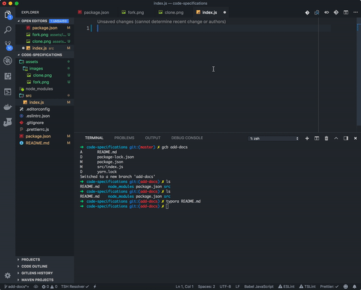
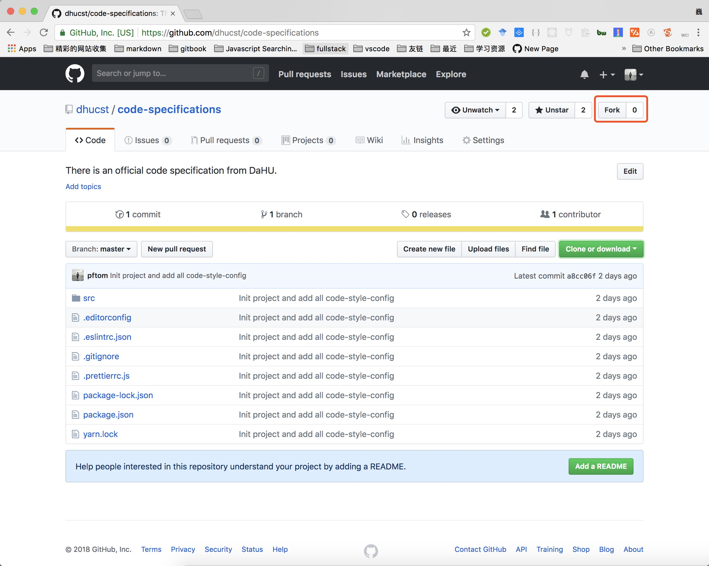
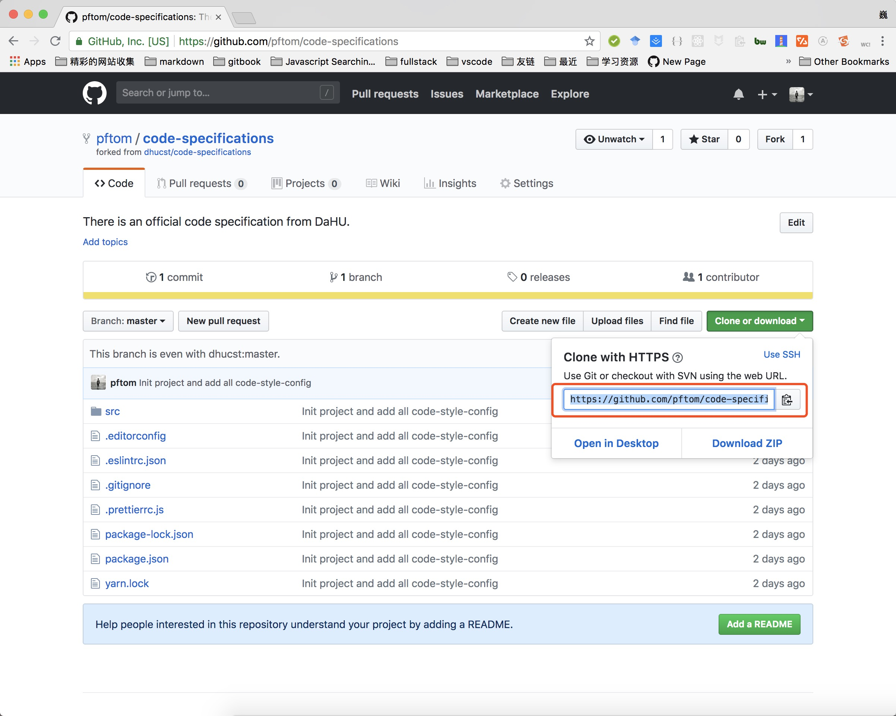

# Code Specifications

This code specification is for better personal code habit and better team collaboration.

Read this in other languages: [简体中文](./README.zh-CN.md).

## Features

This code specifications contains following two characters:

- Standard local coding:
  - We use [Editorconfig](https://editorconfig.org/) for basic format support. Refer to config files [.editorconfig](./.editorconfig) .
  - We use [Prettier](https://prettier.io/) and VSCode editor setting `editor.formatOnSave` for format code at coding time. Refer to config files [.prettierrc.js](./.prettierrc.js) .
  - We use [ESLint](https://eslint.org/) to complement Prettier. Refer to config files [.eslintrc.json](./.eslintrc.json) .
- Staged files check:
  - We use [husky](https://github.com/typicode/husky) to work with Git hooks for running some commands such as Lint, Test, etc .
  - We use [lint-staged](https://github.com/okonet/lint-staged) to work with files to be committed for better performance.

## Prerequisite

As this code specifications strongly depend on code editor [VSCode](https://code.visualstudio.com/) , so we need install it.

Also, we need install several VSCode plugins: [Prettier](https://marketplace.visualstudio.com/items?itemName=esbenp.prettier-vscode) , [ESLint](https://marketplace.visualstudio.com/items?itemName=dbaeumer.vscode-eslint) , [EditorConfig](https://marketplace.visualstudio.com/items?itemName=EditorConfig.EditorConfig) .

## How to use

Just clone this repository to your local machine and then install related dependencies.

```shell
git clone https://github.com/dhucst/code-specifications.git
cd code-specifications && npm install
```

And then enjoying standard happy coding.

## Example



## Contributing

**We want contributing to this code specifications to be fun, enjoyable, and educational for anyone, and everyone.** You just need the following steps:

Fork this repository.



Clone this forked repository to your local machine.



And then clone this repository, add your improvement and make a PR.

```shell
git clone https://github.com/pftom/code-specifications.git
cd code-specifications && npm install
```
